# Prometheus 系统监控与压力测试

## Intro

### What is Prometheus

Prometheus（普罗米修斯）是一套开源的监控&报警&时间序列数据库的组合。其监控的基本原理是通过HTTP协议周期性抓取被监控组件的状态，这样做的好处是任意组件只要提供HTTP接口就可以接入监控系统，不需要任何SDK或者其他的集成过程。这样做非常适合虚拟化环境，比如VM或者Docker。

本文内容既是使用Prometheus监控我们的Spring微服务，进行压力测试与并发测试。

## Installation & Configuration

### 运行环境

本文的Spring应用程序运行在Windows下的JVM中，CPU为四核四线程i5，内存8G，Java版本8。Prometheus运行在VMware workstation虚拟机下的Ubuntu18.04环境中，使用最新版本的docker。非并发接口测试使用Windows环境下的Postman，并发测试使用ApacheBenchmark（`ab`命令），运行在WSL下。

### Spring端

在Spring项目的maven配置文件中加上Prometheus依赖即可。

```xml
<dependency>
    <groupId>io.micrometer</groupId>
    <artifactId>micrometer-registry-prometheus</artifactId>
</dependency>
```

### 服务端

使用Docker，拉取Prometheus的Docker Image，填写配置文件即可运行。配置详情可参考这篇文章：https://www.callicoder.com/spring-boot-actuator-metrics-monitoring-dashboard-prometheus-grafana/#downloading-and-running-prometheus-using-docker

### 运行效果

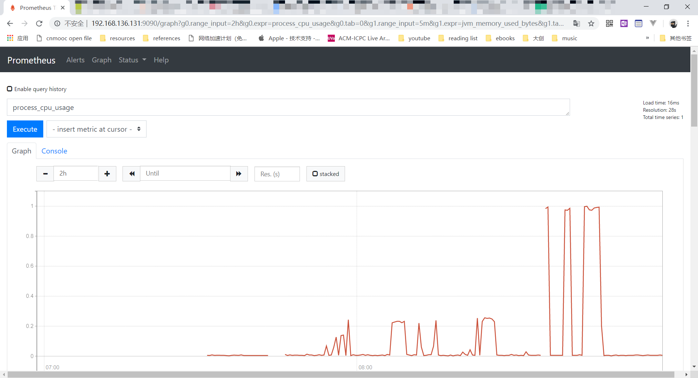

## 压力测试

压力测试主要看Spring应用程序的CPU占用、JVM内存占用与Tomcat线程使用情况这三项指标。

### 简单请求与复杂请求

笔者准备了两个测试用例，用于测试应用性能：

* 简单请求：`/get-ladder?src=path&dst=love`，ladder长度为5，单次请求约使用300ms。
* 复杂请求：`/get-ladder?src=charge&dst=comedo`，根据[这篇文章](<https://blog.wolfram.com/2012/01/11/the-longest-word-ladder-puzzle-ever/>)可知是最长的ladder，在测试中，ladder长度为23，单次请求约使用7000ms。


### 非并发简单请求测试

使用postman进行普通的接口测试，HTTP请求会接连发送，共发送200次。

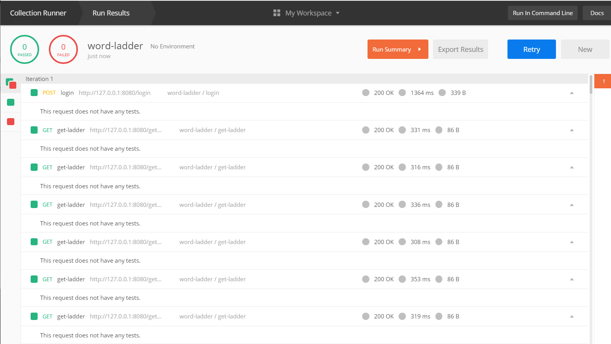

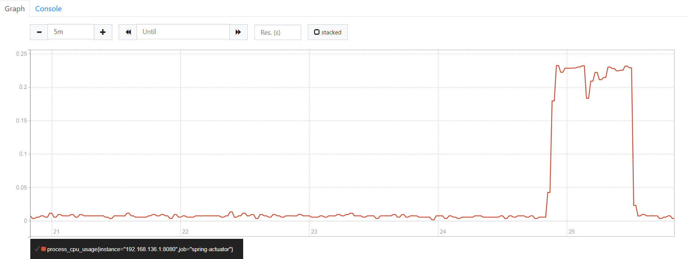

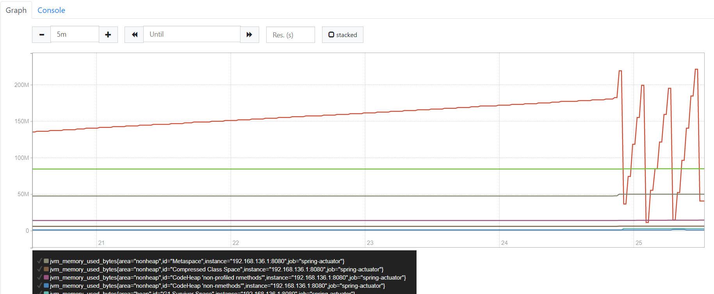

可以看到系统应对游刃有余，CPU队列长度不到0.25，没有占满一个核心。不过，大量请求带来了大量GC。原因可能在于内部实现时每次处理请求都要重新加载字典文件。

### 非并发复杂请求测试

这次使用postman发送20次复杂请求。可以看到平均响应时间在7s左右。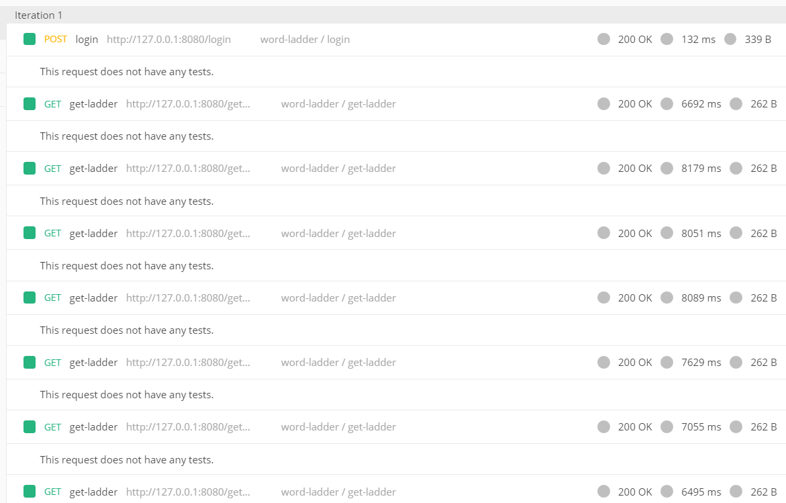

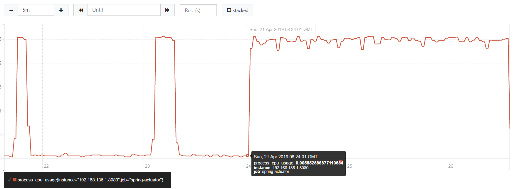

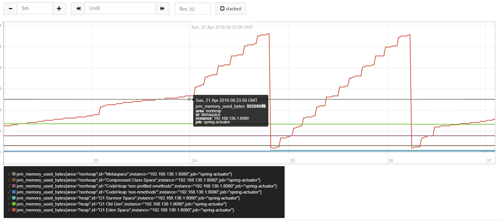

CPU占用在0.25上下徘徊，占满了一个核心，GC次数有所减少。分析内存占用的图像可以看到，每次请求所需要分配的堆内存在10M左右，GC后大约10~11次请求会触发GC，可知JVM堆空间限制在128M左右。JVM中的自动GC操作会占用大量程序运行时间，对应用运行的流畅性构成挑战。因此应对请求数量高的微服务，应尽量提高JVM内存限制，同时优化内存使用，减少不必要的空间浪费（比如，每次请求都重新读取字典文件）。

### 并发简单请求测试

笔者通过`ab`命令（Apache Benchmark）对服务进行并发测试。由此，事情开始变得有趣起来。

* 并发数量100

以下为测试结果（省略了一些不必要的输出）：

```
$  ab -n 1000 -c 100 http://localhost:8080/get-ladder\?src\=path\&dst\=love
This is ApacheBench, Version 2.3 <$Revision: 1807734 $>
Copyright 1996 Adam Twiss, Zeus Technology Ltd, http://www.zeustech.net/
Licensed to The Apache Software Foundation, http://www.apache.org/

Server Software:
Server Hostname:        localhost
Server Port:            8080

Document Path:          /get-ladder?src=path&dst=love
Document Length:        86 bytes

Concurrency Level:      100
Time taken for tests:   70.171 seconds
Complete requests:      1000
Failed requests:        0
Total transferred:      387000 bytes
HTML transferred:       86000 bytes
Requests per second:    14.25 [#/sec] (mean)
Time per request:       7017.129 [ms] (mean)
Time per request:       70.171 [ms] (mean, across all concurrent requests)
Transfer rate:          5.39 [Kbytes/sec] received

Connection Times (ms)
              min  mean[+/-sd] median   max
Connect:        0 1057 1072.2    640    3899
Processing:   817 5890 2223.3   5613   11820
Waiting:      786 5174 2366.1   4735   10993
Total:        947 6947 1935.7   7078   11904

Percentage of the requests served within a certain time (ms)
  50%   7078
  66%   7783
  75%   8368
  80%   8570
  90%   8955
  95%   9480
  98%  10993
  99%  11821
 100%  11904 (longest request)
```

可看到平均响应时间为7s左右，总体平均响应时间在72ms，约等于(300/4)ms。测试过程中笔者的电脑卡死，鼠标也动不了，Prometheus服务也出现了断续的情况：

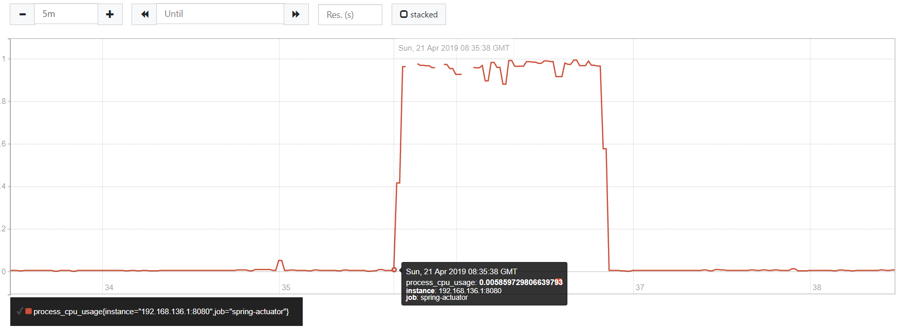

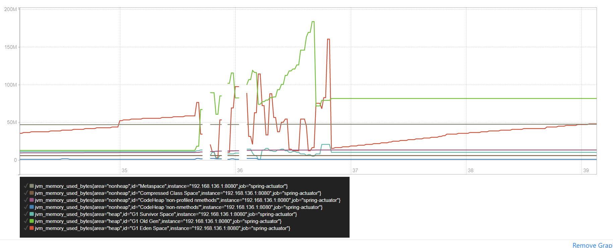

可以看到CPU的4个核心都被Spring应用所占满，由于请求的大量加入，GC的反应也变得迟钝了，Old Gen的堆空间一路冲高到180M左右。以下是线程数量图：

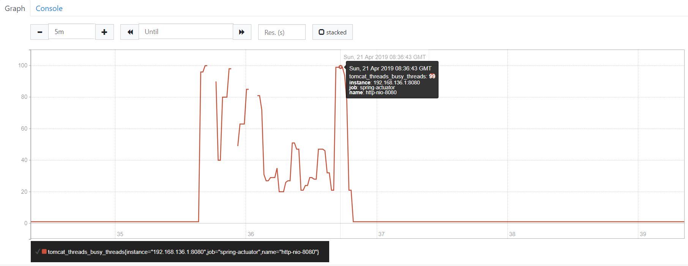

可以看到在高并发测试中应用的表现不是很稳定，线程数量在大多时间远少于100个。

* 并发数量20

```
$  ab -n 1000 -c 20 http://localhost:8080/get-ladder\?src\=path\&dst\=love
This is ApacheBench, Version 2.3 <$Revision: 1807734 $>
Copyright 1996 Adam Twiss, Zeus Technology Ltd, http://www.zeustech.net/
Licensed to The Apache Software Foundation, http://www.apache.org/

Server Software:
Server Hostname:        localhost
Server Port:            8080

Document Path:          /get-ladder?src=path&dst=love
Document Length:        86 bytes

Concurrency Level:      20
Time taken for tests:   72.992 seconds
Complete requests:      1000
Failed requests:        0
Total transferred:      387000 bytes
HTML transferred:       86000 bytes
Requests per second:    13.70 [#/sec] (mean)
Time per request:       1459.844 [ms] (mean)
Time per request:       72.992 [ms] (mean, across all concurrent requests)
Transfer rate:          5.18 [Kbytes/sec] received

Connection Times (ms)
              min  mean[+/-sd] median   max
Connect:        0   47  71.5      1     456
Processing:   708 1401 117.8   1391    1801
Waiting:      707 1352 116.2   1355    1702
Total:        708 1448 136.1   1432    1959

Percentage of the requests served within a certain time (ms)
  50%   1432
  66%   1496
  75%   1533
  80%   1561
  90%   1641
  95%   1687
  98%   1726
  99%   1772
 100%   1959 (longest request)
```

在并发数量20的情况下服务反应稳定了很多，总体平均响应时间与上次测试基本一致，平均响应时间与上一次测试成比例。在线程数量图中可以看到线程数在20上下徘徊，比前一次测试稳定。

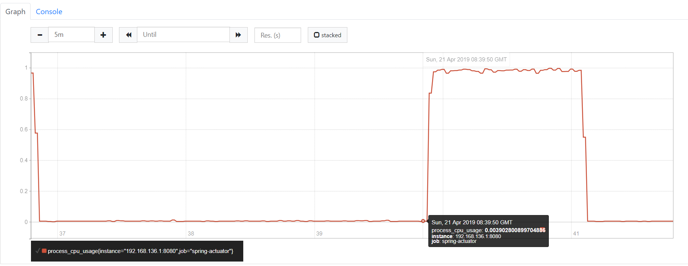

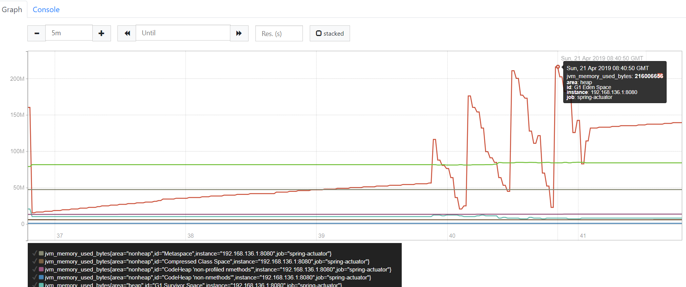

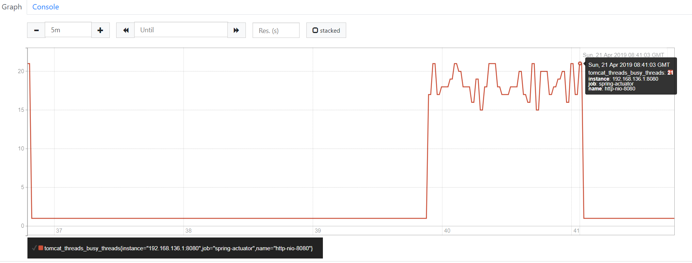

总体来说，应用应对并发的能力并不是很突出。

### 并发复杂请求测试

由于复杂请求耗时很高~~，笔者出于对笔记本的爱护~~设计了并发数为8的复杂请求并发测试。

```
$  ab -n 80 -c 8 http://127.0.0.1:8080/get-ladder\?src\=charge\&dst\=comedo
This is ApacheBench, Version 2.3 <$Revision: 1807734 $>
Copyright 1996 Adam Twiss, Zeus Technology Ltd, http://www.zeustech.net/
Licensed to The Apache Software Foundation, http://www.apache.org/

Benchmarking 127.0.0.1 (be patient).....done


Server Software:
Server Hostname:        127.0.0.1
Server Port:            8080

Document Path:          /get-ladder?src=charge&dst=comedo
Document Length:        262 bytes

Concurrency Level:      8
Time taken for tests:   210.502 seconds
Complete requests:      80
Failed requests:        0
Total transferred:      45040 bytes
HTML transferred:       20960 bytes
Requests per second:    0.38 [#/sec] (mean)
Time per request:       21050.151 [ms] (mean)
Time per request:       2631.269 [ms] (mean, across all concurrent requests)
Transfer rate:          0.21 [Kbytes/sec] received

Connection Times (ms)
              min  mean[+/-sd] median   max
Connect:        0    3  10.5      0      66
Processing: 13089 21020 2791.8  22161   22736
Waiting:    13089 21014 2791.4  22161   22735
Total:      13155 21024 2787.2  22162   22736

Percentage of the requests served within a certain time (ms)
  50%  22162
  66%  22306
  75%  22357
  80%  22408
  90%  22528
  95%  22614
  98%  22710
  99%  22736
 100%  22736 (longest request)
```

在8个并发的复杂请求下，CPU对单个请求的处理速度也下降了，总体平均响应时间在2.6s左右，远超过(7000/4)ms。这是由于同一个CPU逻辑线程有多个CPU-heavy的进程在抢占资源造成的。可以看到CPU占用率一直高居不下。由于并发数量不多，GC与线程数量倒是很稳定，但这也弥补不了响应时间上的短板。

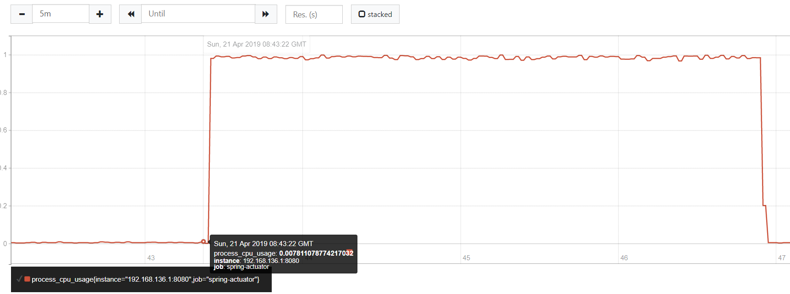

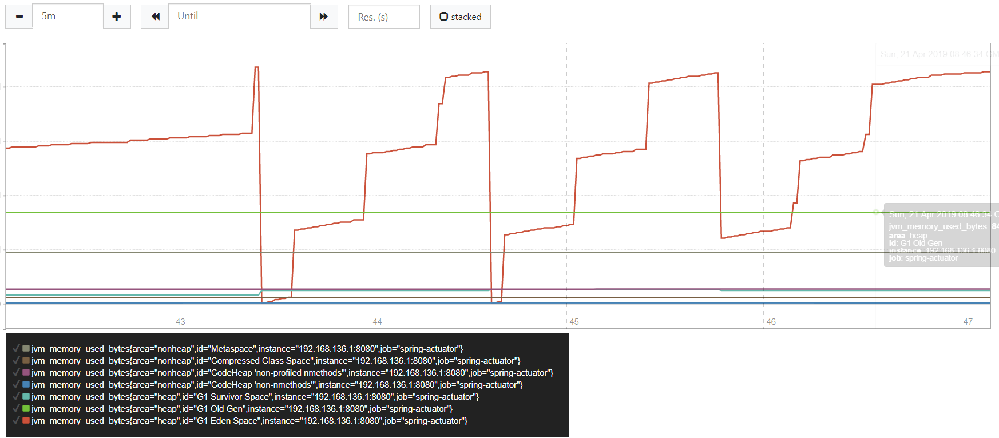

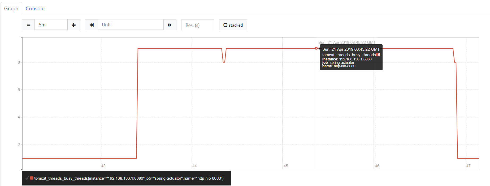

## 总结

* Prometheus是一个方便的服务监控工具。通过HTTP API周期性地抓取状态，Prometheus可以做到轻量的、非侵入式的、高可用的服务监控。
* 本文中所测试的Spring应用并发性能并不是很好，可能的改进方向有以下几个：
  * 优化内存使用，将Word Ladder中的字典文件缓存而非重复读取
  * 提高JVM对内存空间阈值
  * 使用有更多逻辑线程的CPU
  * 对于大量并发的复杂请求，使用队列降低并行数量
  * 使用分布式+LB的硬件架构提高并发效率


## 
