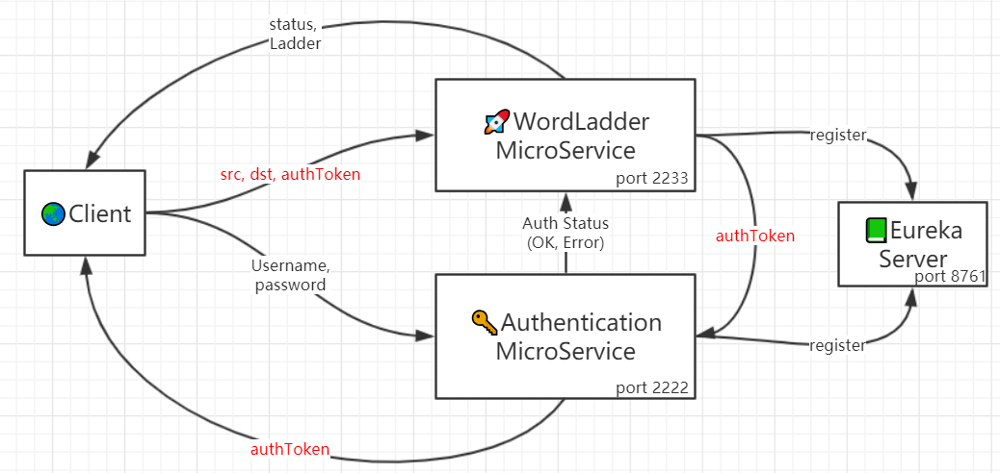
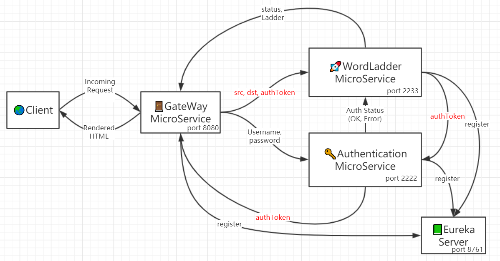
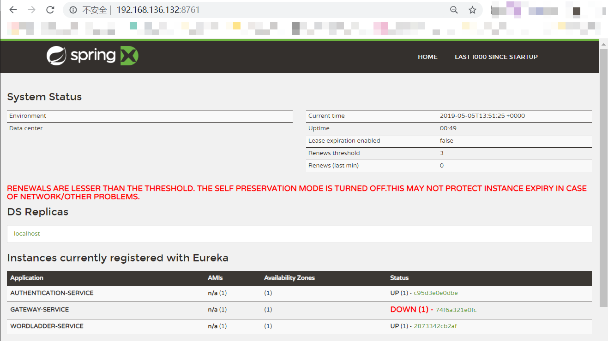
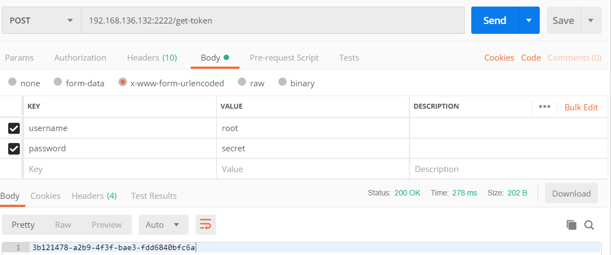
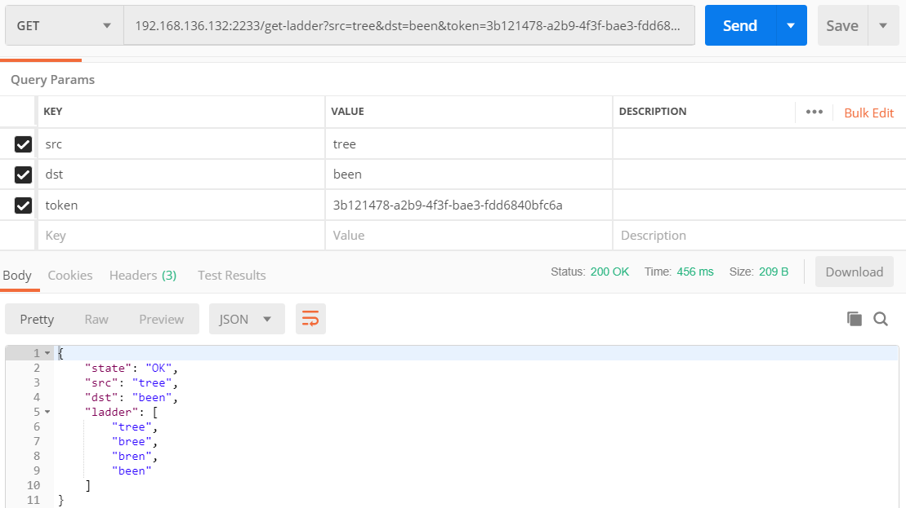
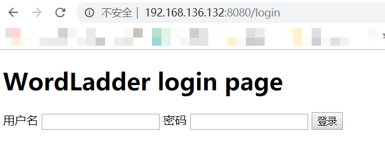
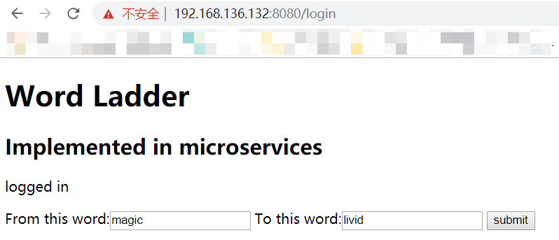
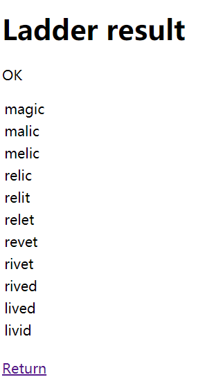

# Task04 WordLadder implemented in microservices

## Brief illustration

This is yet another `WordLadder` project, only divided into spring microservices.

The original app was split into two decoupled microservices:  main `wordladder microservice` and an authentication service `authentication microservice`. Microservices are managed with `Eureka` microservice management tool.




The client will have to access both microservices(on different ports) to make valid requests to the whole application, which is a little inconvenient. To make things easier, a `gateway microservice`  has been implemented to act as the frontend. The client would only have to access the frontend `gateway microservice` , interact with rendered HTML, and the microservice would make RESTful requests to the other two microservices in background.



## Usage

All microservices illustrated above has been containerized and uploaded to docker hub. To set up the whole application, four containerized services would be needed: the `eureka` service, `wordladder` service, `authentication` service and `gateway` service.

### Set up Eureka Server

```bash
docker container network create -d bridge microservices-internal
docker run --network microservices-internal -p 8761:8761 --name eureka springcloud/eureka
```

* An inter-container network is first created to support domain-name based Internet communication between containers.
* `Eureka` image is pulled and ran on port `8761`.

### Set up mandatory microservices

Run following commands to set up mandatory microservices:

```bash
docker run --network microservices-internal -p 2222:2222 --env EUREKA_SERVER=eureka --name auth eyekill/microwordladder-auth
docker run --network microservices-internal -p 2233:2233 --env EUREKA_SERVER=eureka --name ladder eyekill/microwordladder-ladder 
```

Now you can visit the `eureka` web interface at port `8761` to see if the two microservices are up and running.



### Test the application with Postman

To use the application you'll have to follow these steps:

1. Get authentication token from `authentication` service. 

   Make a post request to `http://localhost:2222/get-token`, or wherever you've set up your `authentication` service, with `username` and `password` encoded in form data. The default username is `root` and default password for that user is `secret`. If success, an authentication token, which is essentially a random `GUID`, would be returned in response body.



2. Make a request for a word ladder.

   Make a get request to `http://localhost:2233/get-ladder` or wherever you've set up your `wordladder` service. Three parameters are mandatory: `src`, `dst` and `token`, which stands for the source word, destination word and authentication token you've just retrieved from the authentication service. The `wordladder` service first check the authentication token with the `authentication service` in background,  then calculate and return the ladder if the token is considered valid.

   

### Setup the gateway service

If you want the `gateway` service set up, type in the following command:

```bash
docker run --network microservices-internal -p 8080:8080 --env EUREKA_SERVER=eureka --name gateway eyekill/microwordladder-gateway
```

After it's done, check the `eureka` web interface to see if it's up and running. Then you can visit `localhost:8080` to interact with the web interface.





