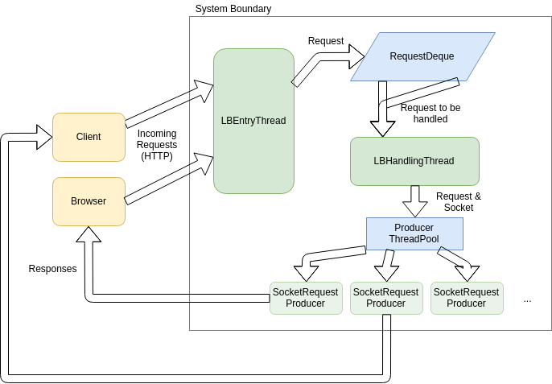
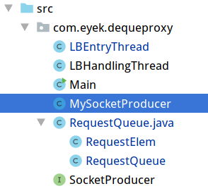
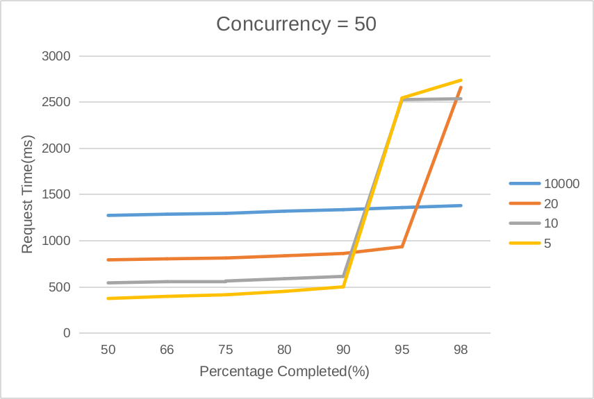
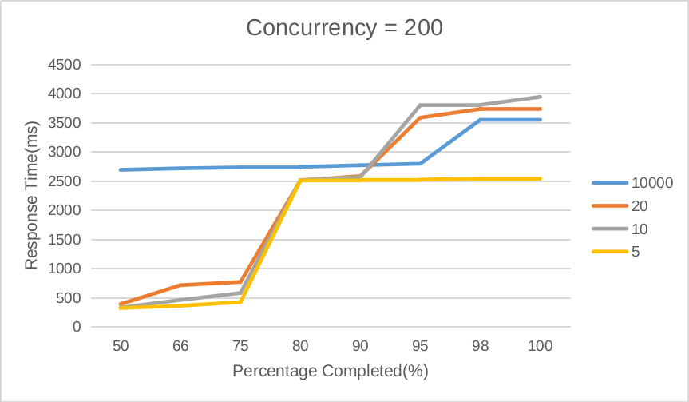
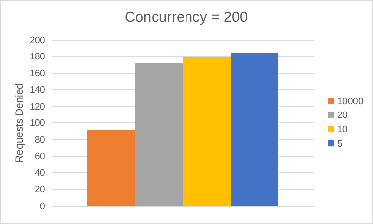

# Implementing a request container in Java

> 陈奕君 517021910387

## Requirements

* Build a service container which can be utilized in cloud computing scenarios.

This container should be able to receive request from the outside world(or **consumers**), redistribute them to the actual service implementations(or **producers**) and enqueue those requests that cannot be executed yet.

To improve the Quality of Service, special strategies should be used when redistributing requests. In real case scenarios, web requests that have persisted for too long are likely to be closed manually by users, so these pending requests usually doesn't need to be dealt with. When there're too many requests pending, ignoring them and handle the next incoming request right away might be a more practical strategy. 

A threshold can be configured for the container instance. The data structure that holds the incoming requests should act like a queue when the number of pending requests is less than the threshold. In other cases, it should act like a stack. Requests that have remained left unprocessed too long should be removed.

## Structure

* The "Stack + Queue" data structure is implemented as a double-linked queue, shown in the diagram as `RequestDeque`. Since the queue can be accessed by multiple threads,  a `LinkedBlockingDeque` is used to keep all operations thread-safe. The threshold values and operations involved are implemented in this class.
* The system takes in incoming HTTP requests from the consumer in the `LBEntityThread`, which will accept the connection and put the socket object into the `RequestDeque`.
* Another thread `LBHandlingThread` gets requests from the `RequestDeque` and distribute them to various `SocketRequestProducers` through the `ProducerThreadPool` thread pool management object. The thread keeps idle until it gets a request object from `RequestDueue`,  then redistribute it immediately if any `SocketRequestProducer` provided by the `ProducerThreadPool` is not busy. When there's no `SocketRequestProducer` available, the `LBHandlingThread` holds until one of them finishes its previous task.

## Testing

We simulate multiple-consumer scenarios by making concurrent requests with **Apache benchmark**(the `ab` command) from `apache-tools`.  To test the program by yourself:

* Start up the Java application in `Intellij IDEA`
* start Apache benchmark in a console: `ab -n 2000 -c $CONCURRENCY -r -s 5 http://localhost:9000/`, where `$CONCURRENCY` is your intended number of concurrent requests.
* Since `ab` won't handle force-closed sockets gracefully, it's possible that you would see an error instead of the stats after the test completes. In such case, you'll only need to `Ctrl-C` the benchmark program when the Java application has finished processing all requests(pay attention to the Java console output).

In the source code, a `MySocketProducer` is a simple implementation of `SocketProducer` interface, which can take in simple HTTP requests, and use `Thread.sleep` to simulate business logics.  By default, it delays for a random period of time which subjects to the normal distribution $N(250,900)$ in milliseconds. `10` threads are created in the thread pool by default, which means the average time to process concurrent requests should be around `25 milliseconds`, and the system should be able to handle `40` concurrent requests easily. Thus, concurrency level of `50`, `100` and `200` are tested.

Detailed testing results can be found in [results.md](results.md).

With 50 requests in concurrency, the average single request processing time is around 1300-1400 ms when no stack is used. Things get a lot better when stacks are used, pushing the median processing time to around 800 ms(threshold=20), 500 ms(threshold=10) and 400 ms(threshold=5). However, number of denials of service keeps going up too, and when using 5 as the queue threshold, about 5-10% of requests are delayed, which is not acceptable.

These figures escalate when using concurrency = 200. At this level, the stack-less version of our container is also experiencing bottleneck, whose response time rises to about 3500 ms at 98%, while others can remain a much lower response time on average, and similar response time in edge cases. But, when we take a look at the number of requests denied, the stacked version container has about twice as many as the stack-less version, which adds to the already unacceptable QoS.

